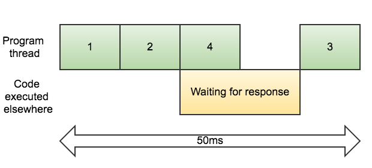

# Presentación

### Intro

JavaScript es single thread* y asíncrono.

_Everything runs on a different thread except our code._

Las llamadas a operaciones asíncronas, tales como lectura/escritura de archivos o consultas a una base de datos, pueden ser ejecutadas de manera secuencial o en paralelo.

##### Secuencial:

```javascript
const file1 = fs.readFileSync('file1.txt');
console.log(1);

const file2 = fs.readFileSync('file2.txt');
console.log(2);

const file3 = fs.readFileSync('file3.txt');
console.log(3);

/*
 *  Results:
 *  
 *    1
 *    2
 *    3
 */
```


##### Asíncrono:

```javascript
fs.readFile('file1.txt', (err, file) => {
  console.log(1);
});

fs.readFile('file2.txt', (err, file) => {
  console.log(2);
});

fs.readFile('file3.txt', (err, file) => {
  console.log(3);
});

/*
 *  Results:
 *  
 *    1
 *    3
 *    2
 */
```




##### El problema de los callbacks

Si necesitamos utilizar el resultado de una operación asíncrona en otra, tarde o temprano nos topamos con el siguiente problema:

```javascript
fs.readFile('file1.txt', (err, file) => {
  if (err) {
    /* :( */
  } else {
    /* Success! */
    fs.readFile('file2.txt', (err, file) => {
      if (err) {
        /* :( */
      } else {
        /* Success! */

        /* And it goes on and on and on and on... */

      })
    }
  }
});
```

### Promesas

Para operaciones asíncronas, javascript provee algunas herramientas. Las promesas son objetos que representan una operación que no se ha completado y que se espera que se complete en el futuro.

```javascript
const promise = new Promise((resolve, reject) => {

  /* Something asynchronous */

  if (/* something else */) {
    resolve(result);
  } else {
    reject(error);
  }

});

promise.then(result => {

}).catch(error => {

});
```

##### Encadenamiento:

Los ```then()``` devuelven una nueva promesa, por lo que podemos encadenarlas:
```javascript
promise.then(result1=> {

}).then(result2 => {

}).then(result3 => {

}).catch(error => {

});


promise.then(result1 => {

}).catch(error1 => {

}).then(result2 => {

}).catch(error2 => {

});
```

##### ¿Y si tenemos varias promesas?

```javascript
Promise.all([p1, p2, p3]).then([r1, r2, r3] => {

}).catch(error => {

});

```

De esta manera podemos realizar lo que queramos una vez que tengamos todos los resultados (si resolvemos todas las promesas por separado, entonces no podríamos usar todos los resultados al mismo tiempo). Si alguna de esas promesas arroja un error, se pasa al `catch`.

Por último, recordemos que las arrow functions tienen scope de bloque.

### Profundizando en la ejecución single thread y asíncrona

Tal y como dijimos al principio, todo corre en un thread diferente excepto el código que nosotros escribamos.

Luego, todo el código de los *callbacks*, ```then()``` o ```catch()``` se ejecuta en el mismo thread que el resto de nuestro código. ¿Cómo ocurre esto?

Cuando estas instrucciones estén listas para ser ejecutadas, se guardan en una cola de espera en una entidad abstracta que llamaremos `Job`.

Una vez que no exista código propio en ejecución, se ejecuta alguno de los `Job` que está pendiente. Cuando esto sucede, se garantiza que ningún otro `Job` se ejecutará hasta que el actual termine. Sin embargo, es posible que el `Job` que se está ejecutando actualmente cree otros `Job`, los que se ejecutarán en algún momento.

#### Consecuencias

- No hay problemas de concurrencia
- Se puede garantizar un orden parcial de las operaciones

Sin embargo, esto también implica que ciertos programas funcionen inesperadamente lento:

```javascript

const start = new Date().getTime();
const wait = 5000;

setTimeout(function(){
  alert('Wait one second')
}, 1000);

while(new Date().getTime() < start + wait);

```

Sin conocer lo señalado anteriormente, esperaríamos que el mensaje de alerta salga en 1 segundo aproximadamente. Sin embargo, sale aproximadamente a los 5 segundos.

### ```Async``` / ```await```

Vienen en el estándar ES7. Estas keywords sirven para trabajar con las promesas de una forma **aún** más limpia.

### References

#### About single-threaded and async execution

- [ECMA2015 spec](http://www.ecma-international.org/publications/files/ECMA-ST-ARCH/ECMA-262%206th%20edition%20June%202015.pdf)
- [How is javascript asynchronous AND single threaded?](http://www.sohamkamani.com/blog/2016/03/14/wrapping-your-head-around-async-programming/)
- [Promises libraries are implemented with event loops](http://stackoverflow.com/questions/23447876/why-do-promise-libraries-use-event-loops)
- [Node.js event loop](https://nodesource.com/blog/understanding-the-nodejs-event-loop/)
