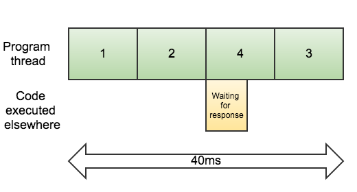

# Presentación

### Intro

Javascript es single thread* y asíncrono. 
  
_Everything runs on a different thread except our code._

Las llamadas a operaciones asíncronas, tales como lectura/escritura de archivos o consultas a una base de datos, pueden ser ejecutadas de manera secuencial o en paralelo.

##### Secuencial:

```javascript
const file1 = fs.readFileSync('file1.txt');
console.log(1);

const file2 = fs.readFileSync('file2.txt');
console.log(2);

const file3 = fs.readFileSync('file3.txt');
console.log(3);

/*
 *  Results:
 *  
 *    1
 *    2
 *    3
 */
```


##### Asíncrono:

```javascript
fs.readFile('file1.txt', (err, file) => {
  console.log(1);
});

fs.readFile('file2.txt', (err, file) => {
  console.log(2);
});

fs.readFile('file3.txt', (err, file) => {
  console.log(3);
});

/*
 *  Results:
 *  
 *    1
 *    3
 *    2
 */
```




### Promesas

Para operaciones asíncronas, javascript provee algunas herramientas. Las promesas son objetos que representan una operación que no se ha completado y que se espera que se complete en el futuro.

```javascript
const promise = new Promise((resolve, reject) => {

  /* Something asynchronous */

  if (/* something else */) {
    resolve(result);
  } else {
    reject(error);
  }
   
});

promise.then(result => {
  
}).catch(error => {

});
```

##### Encadenamiento:

```javascript
promise.then(result1=> {
  
}).then(result2 => {

}).then(result3 => {

}).catch(error => {

});


promise.then(result1 => {

}).catch(error1 => {

}).then(result2 => {

}).catch(error2 => {

});
```

##### Y si tenemos varias promesas?

```javascript
Promise.all([p1, p2, p3]).then([r1, r2, r3] => {

}).catch(error => {

});

```

Pero aquí no podemos garantizar el orden en que llegan las respuestas. Si alguna de esas promesas arroja un error, se pasa al `catch`.

Arrow functions tiene scope de bloque.


### async await

### References

#### About single-threaded and async execution

[How is javascript asynchronous AND single threaded?](http://www.sohamkamani.com/blog/2016/03/14/wrapping-your-head-around-async-programming/)
[Here there are mentions to promises implementations with event loops, based on an specification](http://stackoverflow.com/questions/23447876/why-do-promise-libraries-use-event-loops)
[Node.js event loop](https://nodesource.com/blog/understanding-the-nodejs-event-loop/)
